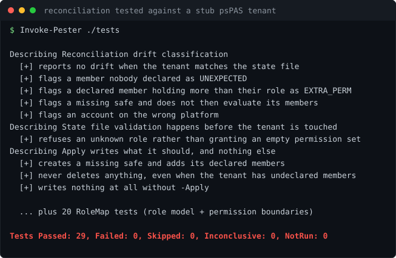

# Lab 11: CyberArk/Idira PAM Automation with psPAS

<p align="center"></p>


[](https://github.com/ChromeData/psPAS-PAM-Automation/actions/workflows/tests.yml)

**Most CyberArk work is done by clicking through the web console. This does it from a file: safes, membership, and accounts declared once, then a script that finds every difference between that file and the live vault.**

| | |
|---|---|
| **Domains** | CyberArk/Idira, PowerShell |
| **Built on** | [pspete/psPAS](https://github.com/pspete/psPAS), [cyberark/epv-api-scripts](https://github.com/cyberark/epv-api-scripts) |
| **Cost** | $0 against a trial or lab tenant. **Runtime** ~3 hours |
| **Status** | Reconciliation logic tested against a stub psPAS tenant, 29 tests, suite verified by sabotage (findings/). Live EPV run still needs a tenant |

## Situation

Clicking does not scale and it leaves no evidence. Onboard fifty accounts by hand and you get fifty chances to fumble a checkbox, with no record of what you meant to do.

## Task

Treat the vault like source control: declare the state once, then continuously prove reality matches. The proving half is the part that is actually rare.

## Action

CyberArk safe membership is about 22 separate checkboxes. Hand that to whoever edits the config and you get drift by lunchtime. So the state file speaks in three roles, and [scripts/RoleMap.psm1](./scripts/RoleMap.psm1) is the only place they are translated:

| Role | Can | Cannot |
|---|---|---|
| audit | list accounts, read the log | retrieve a credential |
| use | retrieve, connect, trigger CPM | manage the safe or membership |
| full | administer the safe and its members | self approve dual control requests |

The audit line is the one people get wrong: listing accounts feels harmless, retrieving is the actual boundary, and they get granted together constantly. Here that is a test, not a convention.

The reconciler reports four kinds of drift in order of how much they should worry you: an undeclared member (access no document explains), privilege creep, something missing, and a member below their role.

## Result

**The reconciliation engine — the part that decides who gets what — is proven end to end without a CyberArk tenant.** There is no free self-hosted EPV, so I built a stub tenant that shadows the psPAS module via `PSModulePath`, letting the reconciler run completely unmodified against scripted drift: an undeclared member, privilege creep, a missing safe, an account on the wrong platform. Each case asserts both what `-Apply` changed and what it left alone.

29 tests, up from the 20 that cover the role model, which stays its own module because who-gets-what is the part you most need certainty about. And the suite itself was verified by sabotage: I broke the "undeclared member" detection, watched the tests go red, and restored it — because a test that has never been seen to fail is a test nobody has checked. Full output in [findings/reconciliation-contract-tests.txt](./findings/reconciliation-contract-tests.txt).

The design decision that reads as experience: `-Apply` creates what is missing and resets permissions down to the declared role, but **never deletes** a member or a safe. A reconciler with delete rights will, the first time the state file is wrong, revoke access during an incident. The stub enforces it — it exports no `Remove-*` cmdlet, so a deletion path added later fails loudly instead of silently revoking access in a test.

## What I did not build

psPAS is pspete's module, and every vault call goes through it. The role model, the reconciler and drift classification, the tests, and the safety decisions are mine.

## Run it

```powershell
./scripts/Connect-Lab.ps1
./scripts/Test-Reconciliation.ps1                      # report only, writes nothing
./scripts/Test-Reconciliation.ps1 -Apply -WhatIf       # show what would change
./scripts/Test-Reconciliation.ps1 -Apply               # converge
./scripts/Disconnect-Lab.ps1
```

Needs PowerShell 7+, psPAS, powershell-yaml, and a CyberArk/Idira tenant (the trial works).

## Findings

[`findings/`](./findings/) holds the reconciliation contract-test run against a stub psPAS tenant, verified by sabotage. [LAB-NOTES.md](./LAB-NOTES.md) is the log.

## License

Lab code: MIT ([LICENSE](./LICENSE)). psPAS stays MIT, epv-api-scripts Apache 2.0.
